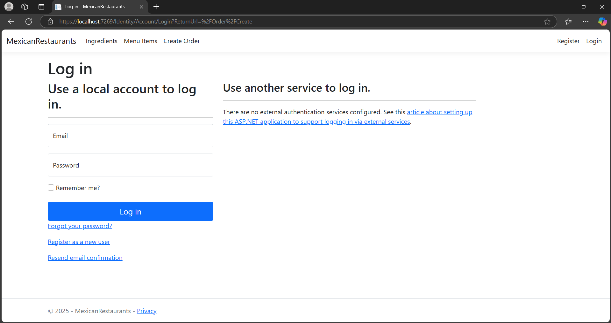
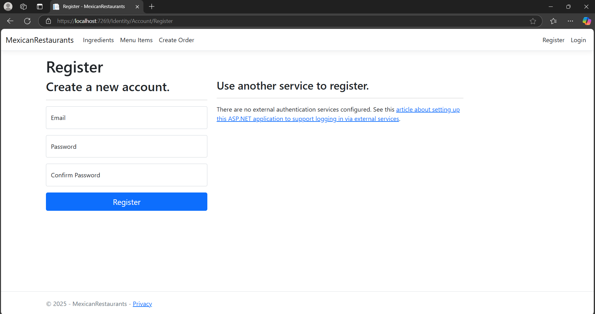
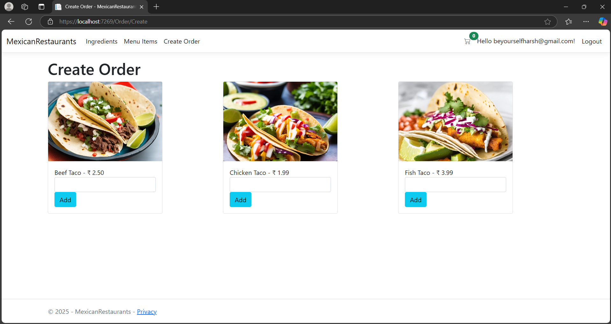
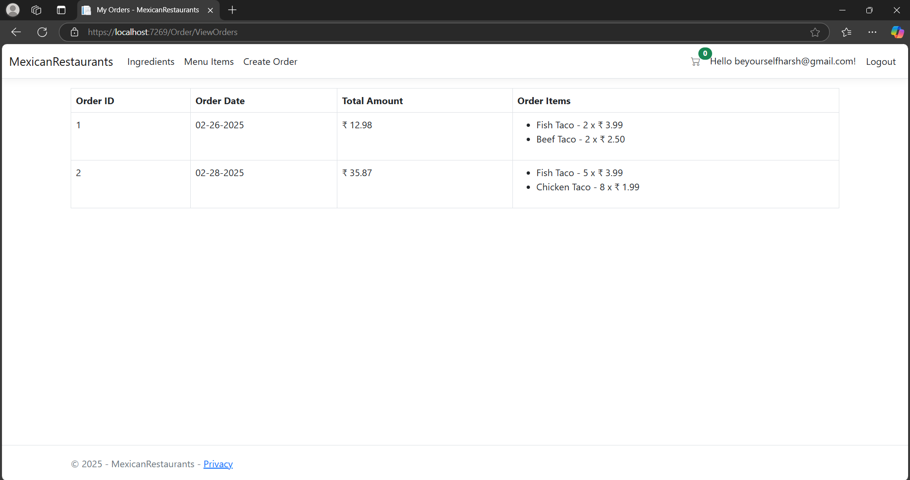
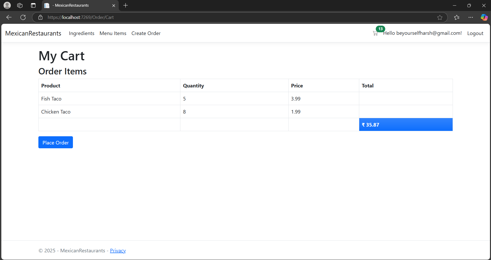
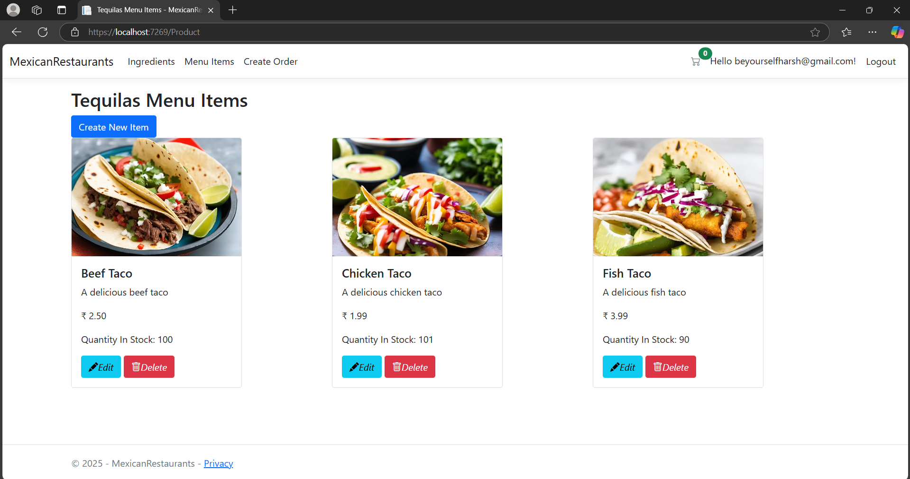
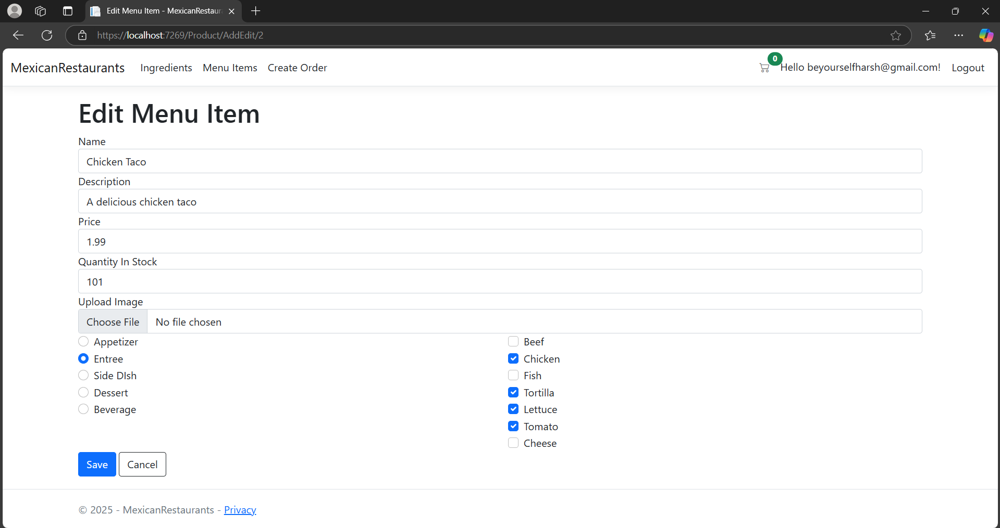

Mexican Restaurant Inventory and Ordering System

Overview

This is a fully functional restaurant inventory and ordering system built using C# and .NET Core with SQL Server as the database. The application utilizes Razor Pages for the frontend and enables restaurant owners and managers to efficiently manage their inventory, track orders, and streamline operations.

Features

User Authentication: Restaurant owners and managers can register and log in securely.

Order Management:

Registered users can place orders.

Users can view past orders for better tracking.

Cart Functionality: A fully functional shopping cart system for managing orders before finalizing them.

Inventory Management:

Users can add new ingredients and products.

Users can edit existing inventory details, ensuring accurate stock levels.

Responsive UI: Built using Razor Pages for a seamless user experience.

Database Integration: Uses SQL Server to store user, order, and inventory data securely.

Technologies Used

Backend: C# with .NET Core

Frontend: Razor Pages

Database: SQL Server

Authentication: ASP.NET Identity

Deployment: Configurable for both local and cloud hosting

Installation & Setup

Clone the repository:

git clone https://github.com/yourusername/mexican-restaurant-app.git
cd mexican-restaurant-app

Configure the database connection in appsettings.json.

Run database migrations:

dotnet ef database update

Start the application:

dotnet run

Open the browser and navigate to http://localhost:5000.

Contribution

Feel free to fork the repository and submit pull requests for enhancements or bug fixes.

This project aims to provide restaurant owners and managers with a simple yet powerful tool to manage their business efficiently. If you find this useful, don't forget to ⭐ the repository!